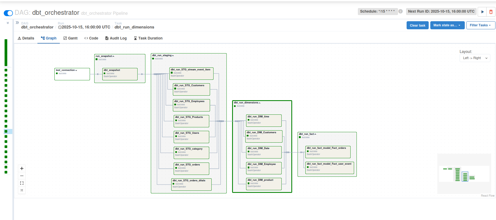
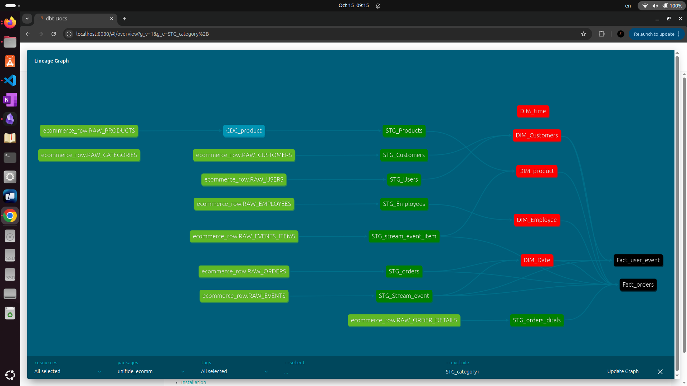

# Unified Data Pipeline

An end-to-end data platform for ingesting, processing, modeling, and serving e‑commerce operational and clickstream data.

Key capabilities:
- Batch and streaming ingestion orchestrated by Airflow
- Real-time event streaming with Kafka
- Data lake storage on MinIO (S3-compatible)
- Transformations with Apache Spark and dbt
- Cloud warehouse in Snowflake 
- Observability and lightweight dashboards with Streamlit


## Architecture at a Glance

High-level lakehouse view:


End-to-end data flow (high level):


End-to-end data flow (low level):


Logical layers in the platform:


Data warehouse dimensional model overview:


Airflow DAGs (batch and dbt):




dbt lineage sample:




## What Changed (Modernization Notes)

- Storage: **MinIO** now replaces AWS S3 for local/dev and self-hosted deployments. It is S3-compatible, so the same `s3a://` paths and clients can be used with updated endpoint/creds.
- Warehouse: **Snowflake** now replaces Amazon Redshift for analytics and BI serving.
- The rest of the stack (Airflow, Kafka, Spark, dbt, Streamlit) remains aligned with the original design.


## Repository Structure

```
.
├── dags/                       # Airflow DAGs (batch, streaming, dbt orchestration)
│   ├── Batch_jop.py
│   ├── DBT_jop.py
│   ├── froms3_to_snowflake.py
│   └── scripts/               # Python operators/utilities (S3/MinIO, Snowflake, etc.)
│       ├── Stream/            # Kafka producer/consumer and stream validations
│       └── Utils/             # DB, S3/MinIO, Snowflake helpers
├── scripts/unifide_ecomm/      # dbt project (models, tests, docs)
├── image/                      # Airflow and dbt screenshots
├──  Data Architecture/         # Draw.io diagrams and architecture overviews
├── docker-compose.yaml         # Orchestration for services (local)
├── dockerfile                  # App/DAG image (root)
├── codespaces/                 # Codespaces Dockerfiles/compose (optional)
├── spark-apps/                 # Spark jobs (if any standalone apps)
├── scripts/profiles.yml        # dbt profile (Snowflake)
├── requirements*.txt           # Python dependencies
└── *.env                       # Credentials and environment configuration
```


## Tech Stack

- Orchestration: Apache Airflow
- Streaming: Apache Kafka (with Producer/Consumer utilities)
- Storage: MinIO (S3-compatible) 
- Compute: Apache Spark
- Transformations/Modeling: dbt (Snowflake adapter)
- Warehouse: Snowflake 
- UI/Monitoring: Streamlit (and Airflow UI)
- Power bi : Reporting 


## Prerequisites

- Docker and Docker Compose
- Access to a Snowflake account (or a trial) for warehouse tests
- Local ports available for Airflow UI, MinIO console/API, Kafka (as defined by `docker-compose.yaml`)


## Quickstart (Local)

1) Configure environment variables

Provide credentials and environment variables. The repository includes sample files you can adapt:

- `aws-credentials.env` (if needed for AWS interop) – not required for pure MinIO
- `s3-credentials.env` – use for MinIO endpoint and keys
- `credentials.env` – general service credentials
- `scripts/profiles.yml` – dbt profile for Snowflake

Minimum variables for MinIO and Snowflake (example):

```bash
# MinIO (S3-compatible)
MINIO_ENDPOINT=http://minio:9000
MINIO_ACCESS_KEY=minioadmin
MINIO_SECRET_KEY=minioadmin
S3_ENDPOINT_URL=http://minio:9000
AWS_ACCESS_KEY_ID=minioadmin
AWS_SECRET_ACCESS_KEY=minioadmin

# Snowflake
SNOWFLAKE_ACCOUNT=xxxxx-xy00000
SNOWFLAKE_USER=your_user
SNOWFLAKE_PASSWORD=your_password
SNOWFLAKE_ROLE=ACCOUNTADMIN
SNOWFLAKE_WAREHOUSE=COMPUTE_WH
SNOWFLAKE_DATABASE=ANALYTICS
SNOWFLAKE_SCHEMA=PUBLIC
```

2) Start the stack

```bash
docker compose -f docker-compose.yaml up -d
```

This brings up core services (e.g., Airflow, Kafka, MinIO, dependencies) as defined in `docker-compose.yaml`.

3) Access UIs

- Airflow Web UI: `http://localhost:8080`
- MinIO Console: `http://localhost:9001` (default creds often `minioadmin` / `minioadmin`)
- Streamlit dashboards: see `run_dashboard.py` or `Stream_lite_dashboard.py` for port configuration


## Using the Pipeline

### Airflow DAGs

- `Batch_jop.py`: Orchestrates batch extraction (source systems → MinIO), Spark transformations, and loads into Snowflake.
- `DBT_jop.py`: Orchestrates dbt runs (models/tests) on Snowflake.
- `froms3_to_snowflake.py`: Focused DAG for moving staged data from MinIO (S3 API) to Snowflake tables.
- `Stream_Produser.py` and `scripts/Stream/Producer.py`/`Consumer.py`: Utilities and DAG(s) for Kafka streaming workloads.

View the DAG graphs in Airflow UI. Example screenshots are under `image/`.

### Streaming

- Producer publishes events (e.g., orders/logs) into Kafka topics.
- Consumer validates and lands events to MinIO (staging) and/or forwards to processing.
- See `dags/scripts/Stream` for `utils.py` and `stream_validations.py`.

### Batch + Spark

- Spark jobs read from `s3a://` paths hitting MinIO using the configured endpoint and credentials.
- Use `spark-defaults`/`core-site.xml` if needed to ensure `fs.s3a.endpoint` and auth providers are set. A helper `check_s3a_config.sh` is included.

### dbt on Snowflake

- dbt project under `scripts/unifide_ecomm` contains models, tests, snapshots, and docs.
- Configure `scripts/profiles.yml` with your Snowflake account/user/role/warehouse/db/schema.
- Run from within the dbt container (or host) after credentials are available:

```bash
dbt deps
dbt seed --profiles-dir ./scripts
dbt run --profiles-dir ./scripts
dbt test --profiles-dir ./scripts
```


## Environment and Credentials

Common files you may adapt/copy to your own `.env`:

- `s3-credentials.env` for MinIO/S3 access
- `aws-credentials.env` only if interacting with AWS directly
- `credentials.env` for service/application secrets
- `scripts/profiles.yml` for dbt/Snowflake

Snowflake network/security: ensure your IP (or the container egress IP) is permitted. Use key-pair auth if preferred and supported by your setup.


## Troubleshooting

- Airflow cannot list MinIO buckets
  - Verify MinIO is up and `MINIO_ENDPOINT`/`S3_ENDPOINT_URL` are reachable from the Airflow container
  - Ensure `AWS_ACCESS_KEY_ID` and `AWS_SECRET_ACCESS_KEY` match MinIO creds

- Spark cannot read `s3a://` paths
  - Check Hadoop/Spark S3A configs (`fs.s3a.endpoint`, `fs.s3a.path.style.access=true` for MinIO)
  - Run `./check_s3a_config.sh` inside the container if provided

- dbt fails to connect to Snowflake
  - Confirm account locator, user, role, warehouse, database, schema in `profiles.yml`
  - Make sure passwords or key-pair auth are correctly mounted into the container

- Kafka consumer not receiving messages
  - Confirm topics exist and producer is pointing to the correct broker/port
  - Check `dags/scripts/Stream/Logs` for validation or error logs


