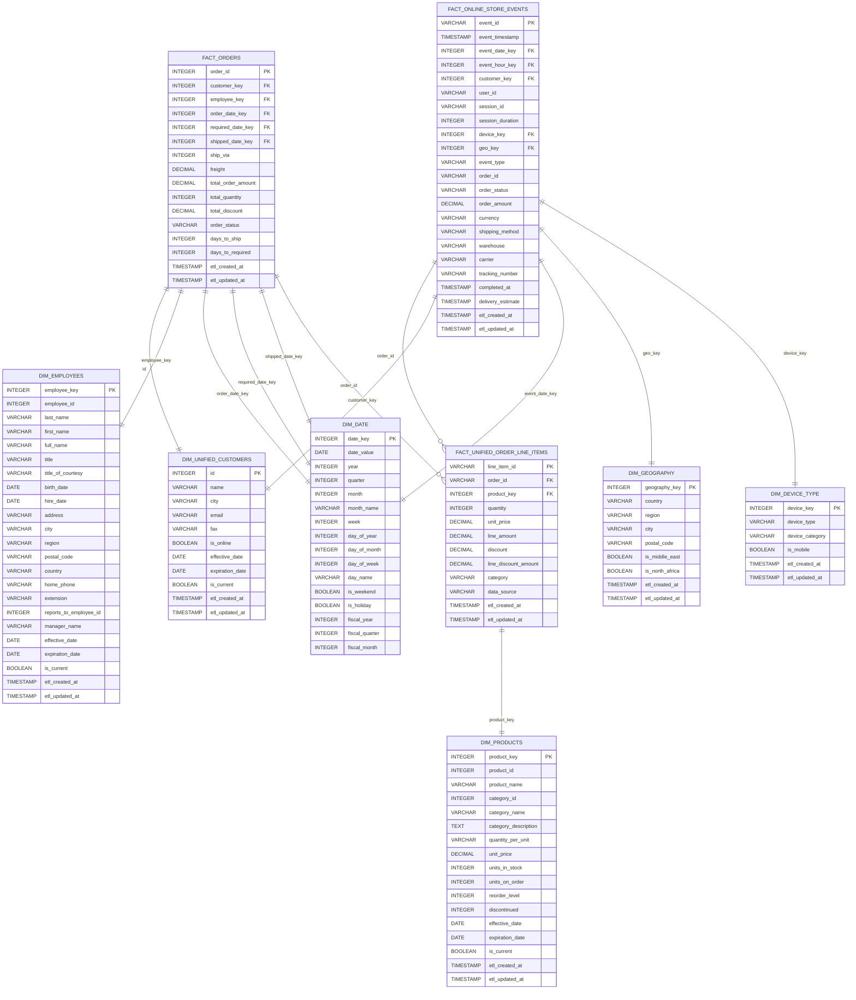

# Data Warehouse Model - Dimensions and Facts

## Overview

This document defines the data warehouse dimensional model for the Unified Data Pipeline project, focusing on the specific OLTP tables and streaming event schema being used. The model follows a star schema approach optimized for analytical reporting and business intelligence.

## Architecture Context

- **Data Sources**: 
  - OLTP PostgreSQL database (hourly batch extracts)
  - Online store streaming events (Kafka/Spark real-time processing)
- **Target Platform**: Amazon Redshift
- **Modeling Tool**: dbt (Bronze/Silver/Gold layers)
- **Consumption**: Power BI dashboards and Streamlit monitoring

## Data Sources Used

### OLTP Tables:
1. **customers** - Customer master data
2. **orders** - Order header information  
3. **order_details** - Order line items
4. **products** - Product catalog
5. **categories** - Product categories
6. **employees** - Employee information

### Streaming Tables:
1. **users** - Online store user data (from streaming events)

## Data Warehouse Model Diagram



## Stream Job Schema

### Online Store Events Structure:
```json
{
  "timestamp": "2025-09-09T12:34:56.789Z",
  "level": "INFO",
  "service": "online-store", 
  "event_type": "order",
  "user_id": "user_123",
  "session_id": "sess_456",
  "session_duration": 900,
  "device_type": "mobile",
  "geo_location": {
    "country": "Egypt",
    "city": "Cairo"
  },
  "details": {
    "order_id": "order_789",
    "status": "completed",
    "order_amount": 129.50,
    "currency": "USD",
    "shipping_method": "standard",
    "shipping_address": "123 Main St, Cairo, Egypt",
    "warehouse": "WH-Cairo",
    "carrier": "DHL",
    "tracking_number": "TRK12345678",
    "completed_at": "2025-09-09T12:35:00.000Z",
    "delivery_estimate": "2025-09-12T12:00:00.000Z",
    "items": [
      {
        "product_id": 42,
        "quantity": 2,
        "unit_price": 64.75,
        "line_amount": 129.50,
        "category": "Beverages"
      }
    ]
  }
}
```

## Fact Tables

### 1. Fact Orders
**Purpose**: Central fact table capturing order-level metrics from OLTP

**Source**: `orders` table + aggregated `order_details`

| Column | Data Type | Description | Source |
|--------|-----------|-------------|---------|
| order_id | INTEGER | Unique order identifier | orders.order_id |
| customer_key | INTEGER | Customer dimension key | customers.customer_id |
| employee_key | INTEGER | Employee dimension key | employees.employee_id |
| order_date_key | INTEGER | Date dimension key | orders.order_date |
| required_date_key | INTEGER | Required date dimension key | orders.required_date |
| shipped_date_key | INTEGER | Shipped date dimension key | orders.shipped_date |
| ship_via | INTEGER | Shipper identifier | orders.ship_via |
| freight | DECIMAL(10,2) | Shipping cost | orders.freight |
| total_order_amount | DECIMAL(10,2) | Sum of line items | Calculated from order_details |
| total_quantity | INTEGER | Total items ordered | Calculated from order_details |
| total_discount | DECIMAL(10,2) | Total discount applied | Calculated from order_details |
| order_status | VARCHAR(20) | Order status | Derived from dates |
| days_to_ship | INTEGER | Days from order to ship | Calculated |
| days_to_required | INTEGER | Days from order to required | Calculated |
| etl_created_at | TIMESTAMP | ETL processing timestamp | System |
| etl_updated_at | TIMESTAMP | ETL update timestamp | System |

### 2. Fact Unified Order Line Items
**Purpose**: Combined product-level order details from both OLTP and streaming

**Source**: `order_details` table + Kafka streaming events (items array)

| Column | Data Type | Description | Source |
|--------|-----------|-------------|---------|
| line_item_id | VARCHAR(50) | Unique line item identifier | Generated |
| order_id | VARCHAR(50) | Order identifier | order_details.order_id / details.order_id |
| product_key | INTEGER | Product dimension key | order_details.product_id / details.items.product_id |
| quantity | INTEGER | Quantity ordered | order_details.quantity / details.items.quantity |
| unit_price | DECIMAL(10,2) | Price per unit | order_details.unit_price / details.items.unit_price |
| line_amount | DECIMAL(10,2) | Line total | Calculated / details.items.line_amount |
| discount | DECIMAL(5,4) | Discount percentage | order_details.discount / NULL for streaming |
| line_discount_amount | DECIMAL(10,2) | Discount amount | Calculated / NULL for streaming |
| category | VARCHAR(50) | Product category | NULL for OLTP / details.items.category |
| data_source | VARCHAR(20) | Source system | 'OLTP' / 'STREAMING' |
| etl_created_at | TIMESTAMP | ETL processing timestamp | System |
| etl_updated_at | TIMESTAMP | ETL update timestamp | System |

### 3. Fact Online Store Events
**Purpose**: Real-time order events from streaming

**Source**: Kafka streaming events (Spark processed)

| Column | Data Type | Description | Source |
|--------|-----------|-------------|---------|
| event_id | VARCHAR(50) | Unique event identifier | Generated |
| event_timestamp | TIMESTAMP | Event occurrence time | timestamp |
| event_date_key | INTEGER | Date dimension key | timestamp |
| event_hour_key | INTEGER | Hour dimension key | timestamp |
| customer_key | INTEGER | Customer dimension key | user_id (mapped to DIM_UNIFIED_CUSTOMERS) |
| user_id | VARCHAR(50) | User identifier | user_id |
| session_id | VARCHAR(50) | Session identifier | session_id |
| session_duration | INTEGER | Session duration in seconds | session_duration |
| device_key | INTEGER | Device dimension key | device_type |
| geo_key | INTEGER | Geography dimension key | geo_location |
| event_type | VARCHAR(50) | Event type (order) | event_type |
| order_id | VARCHAR(50) | Order identifier | details.order_id |
| order_status | VARCHAR(20) | Order status | details.status |
| order_amount | DECIMAL(10,2) | Order total amount | details.order_amount |
| currency | VARCHAR(10) | Currency code | details.currency |
| shipping_method | VARCHAR(20) | Shipping method | details.shipping_method |
| warehouse | VARCHAR(20) | Fulfillment warehouse | details.warehouse |
| carrier | VARCHAR(20) | Shipping carrier | details.carrier |
| tracking_number | VARCHAR(50) | Tracking number | details.tracking_number |
| completed_at | TIMESTAMP | Order completion time | details.completed_at |
| delivery_estimate | TIMESTAMP | Delivery estimate | details.delivery_estimate |
| etl_created_at | TIMESTAMP | ETL processing timestamp | System |
| etl_updated_at | TIMESTAMP | ETL update timestamp | System |

## Dimension Tables

### 1. Dim Unified Customers
**Purpose**: Combined customer data from both OLTP and streaming with SCD Type 2 support

**Source**: `customers` table + `users` table from streaming

| Column | Data Type | Description | Source |
|--------|-----------|-------------|---------|
| id | INTEGER | Surrogate key | Generated |
| name | VARCHAR(100) | Customer name | users.first_name + last_name / customers.contact_name |
| city | VARCHAR(50) | City | users.city / customers.city |
| email | VARCHAR(100) | Email address | users.email |
| fax | VARCHAR(24) | Fax number | customers.fax |
| is_online | BOOLEAN | Online customer flag | TRUE for streaming / FALSE for OLTP |
| effective_date | DATE | SCD effective date | - |
| expiration_date | DATE | SCD expiration date | - |
| is_current | BOOLEAN | Current record flag | - |
| etl_created_at | TIMESTAMP | ETL processing timestamp | - |
| etl_updated_at | TIMESTAMP | ETL update timestamp | - |

### 2. Dim Products
**Purpose**: Product master data with SCD Type 2 support

**Source**: `products` and `categories` tables

| Column | Data Type | Description | SCD Type |
|--------|-----------|-------------|----------|
| product_key | INTEGER | Surrogate key | - |
| product_id | INTEGER | Business key | - |
| product_name | VARCHAR(40) | Product name | Type 2 |
| category_id | INTEGER | Category identifier | Type 2 |
| category_name | VARCHAR(15) | Category name | Type 2 |
| category_description | TEXT | Category description | Type 2 |
| quantity_per_unit | VARCHAR(20) | Unit description | Type 2 |
| unit_price | DECIMAL(10,2) | Current unit price | Type 2 |
| units_in_stock | INTEGER | Current stock level | Type 1 |
| units_on_order | INTEGER | Units on order | Type 1 |
| reorder_level | INTEGER | Reorder threshold | Type 2 |
| discontinued | INTEGER | Discontinued flag | Type 2 |
| effective_date | DATE | SCD effective date | - |
| expiration_date | DATE | SCD expiration date | - |
| is_current | BOOLEAN | Current record flag | - |
| etl_created_at | TIMESTAMP | ETL processing timestamp | - |
| etl_updated_at | TIMESTAMP | ETL update timestamp | - |

### 3. Dim Employees
**Purpose**: Employee master data

**Source**: `employees` table

| Column                 | Data Type   | Description              | SCD Type |
| ---------------------- | ----------- | ------------------------ | -------- |
| employee_key           | INTEGER     | Surrogate key            | -        |
| employee_id            | INTEGER     | Business key             | -        |
| last_name              | VARCHAR(20) | Last name                | Type 2   |
| first_name             | VARCHAR(10) | First name               | Type 2   |
| full_name              | VARCHAR(50) | Full name                | Type 2   |
| title                  | VARCHAR(30) | Job title                | Type 2   |
| title_of_courtesy      | VARCHAR(25) | Courtesy title           | Type 2   |
| birth_date             | DATE        | Birth date               | Type 2   |
| hire_date              | DATE        | Hire date                | Type 2   |
| address                | VARCHAR(60) | Address                  | Type 2   |
| city                   | VARCHAR(15) | City                     | Type 2   |
| region                 | VARCHAR(15) | Region                   | Type 2   |
| postal_code            | VARCHAR(10) | Postal code              | Type 2   |
| country                | VARCHAR(15) | Country                  | Type 2   |
| home_phone             | VARCHAR(24) | Home phone               | Type 2   |
| extension              | VARCHAR(4)  | Work extension           | Type 2   |
| reports_to_employee_id | INTEGER     | Manager employee ID      | Type 2   |
| manager_name           | VARCHAR(50) | Manager full name        | Type 2   |
| effective_date         | DATE        | SCD effective date       | -        |
| expiration_date        | DATE        | SCD expiration date      | -        |
| is_current             | BOOLEAN     | Current record flag      | -        |
| etl_created_at         | TIMESTAMP   | ETL processing timestamp | -        |
| etl_updated_at         | TIMESTAMP   | ETL update timestamp     | -        |

### 4. Dim Date
**Purpose**: Date dimension for time-based analysis

**Source**: Generated

| Column | Data Type | Description |
|--------|-----------|-------------|
| date_key | INTEGER | Date key (YYYYMMDD) |
| date_value | DATE | Actual date |
| year | INTEGER | Year |
| quarter | INTEGER | Quarter (1-4) |
| month | INTEGER | Month (1-12) |
| month_name | VARCHAR(20) | Month name |
| week | INTEGER | Week of year |
| day_of_year | INTEGER | Day of year |
| day_of_month | INTEGER | Day of month |
| day_of_week | INTEGER | Day of week (1-7) |
| day_name | VARCHAR(20) | Day name |
| is_weekend | BOOLEAN | Weekend flag |
| is_holiday | BOOLEAN | Holiday flag |
| fiscal_year | INTEGER | Fiscal year |
| fiscal_quarter | INTEGER | Fiscal quarter |
| fiscal_month | INTEGER | Fiscal month |

### 5. Dim Geography
**Purpose**: Geographic dimension for location analysis

**Source**: `customers`, `employees`, and streaming events geo_location

| Column | Data Type | Description |
|--------|-----------|-------------|
| geography_key | INTEGER | Surrogate key |
| country | VARCHAR(50) | Country name |
| region | VARCHAR(50) | Region/State |
| city | VARCHAR(50) | City name |
| postal_code | VARCHAR(20) | Postal code |
| is_middle_east | BOOLEAN | Middle East region flag |
| is_north_africa | BOOLEAN | North Africa region flag |
| etl_created_at | TIMESTAMP | ETL processing timestamp |
| etl_updated_at | TIMESTAMP | ETL update timestamp |

### 6. Dim Device Type
**Purpose**: Device dimension for online store analytics

**Source**: Streaming events device_type field

| Column | Data Type | Description |
|--------|-----------|-------------|
| device_key | INTEGER | Surrogate key |
| device_type | VARCHAR(20) | Device type (desktop/mobile/tablet) |
| device_category | VARCHAR(20) | Device category (Mobile/Desktop) |
| is_mobile | BOOLEAN | Mobile device flag |
| etl_created_at | TIMESTAMP | ETL processing timestamp |
| etl_updated_at | TIMESTAMP | ETL update timestamp |

## Data Quality and Governance

### Data Quality Metrics
- **Completeness**: Track null values in key fields
- **Accuracy**: Validate data ranges and formats
- **Consistency**: Cross-reference between OLTP and streaming data
- **Timeliness**: Monitor data freshness and processing delays

### SCD Implementation
- **Type 1**: Attributes that don't need history (stock levels, units on order)
- **Type 2**: Attributes requiring full history (names, addresses, prices)
- **Type 3**: Future implementation for limited history tracking

### ETL Considerations
- **Incremental Loading**: Process only changed records from OLTP
- **Streaming Integration**: Real-time processing of Kafka events
- **Data Validation**: Great Expectations for quality checks
- **Error Handling**: Route invalid data to quarantine zone

## Business Metrics and KPIs

### OLTP Sales Performance (from orders, order_details, customers, products)
- Total revenue by time period
- Order volume and frequency  
- Average order value
- Product performance rankings (by category)
- Customer segmentation analysis
- Employee sales performance
- Order fulfillment times
- Geographic sales distribution

### Online Store Analytics (from streaming events)
- Real-time order monitoring
- User engagement metrics (session duration)
- Device and geographic trends (mobile vs desktop)
- Conversion analysis by device type
- Geographic performance (Egypt, Saudi Arabia, UAE, etc.)
- Warehouse fulfillment performance
- Carrier delivery performance
- Session-based analytics

## Implementation Notes

### dbt Model Structure
```
models/
├── bronze/
│   ├── orders.sql
│   ├── order_details.sql
│   ├── customers.sql
│   ├── users.sql
│   ├── products.sql
│   ├── categories.sql
│   ├── employees.sql
│   └── stream_events.sql
├── silver/
│   ├── stg_orders.sql
│   ├── stg_order_details.sql
│   ├── stg_customers.sql
│   ├── stg_users.sql
│   ├── stg_products.sql
│   ├── stg_categories.sql
│   ├── stg_employees.sql
│   └── stg_stream_events.sql
└── gold/
    ├── fact_orders.sql
    ├── fact_unified_order_line_items.sql
    ├── fact_online_store_events.sql
    ├── dim_unified_customers.sql
    ├── dim_products.sql
    ├── dim_employees.sql
    ├── dim_date.sql
    ├── dim_geography.sql
    └── dim_device_type.sql
```

### Performance Optimization
- **Distribution Keys**: Use customer_id and order_id for even distribution
- **Sort Keys**: Use date columns for time-series queries
- **Compression**: Apply appropriate compression encodings
- **Indexes**: Create indexes on frequently queried columns

### Security and Access
- **Row-Level Security**: Implement RLS for customer data
- **Column-Level Security**: Mask sensitive PII fields
- **Role-Based Access**: Different access levels for different user groups
- **Audit Logging**: Track data access and modifications

This dimensional model provides a comprehensive foundation for analytical reporting, business intelligence, and real-time monitoring across both transactional and behavioral data sources.
