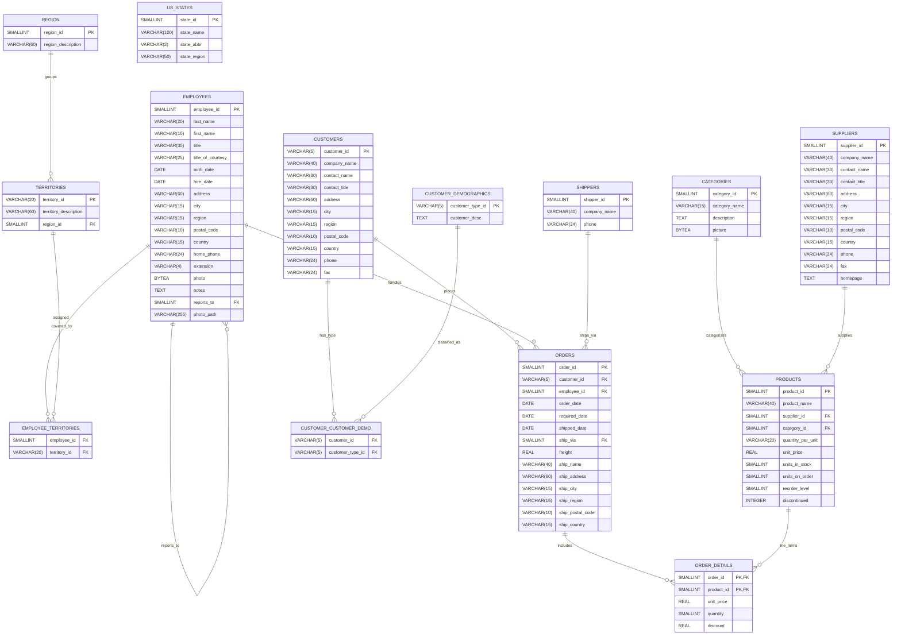

### Identifying Data Sources

## 1. OLTP Database (On-Premises Transactional System)
This database is the primary system for recording day-to-day business operations. It stores highly structured, relational data optimized for high-volume reads and writes with strict transactional guarantees. Typical transactions include placing orders, updating inventory, managing customers and suppliers, and recording shipping details. It acts as the single source of truth for transactional records.

- **Primary entities**: `Orders`, `Order_Details`, `Customers`, `Employees`, `Products`, `Categories`, `Suppliers`, `Shippers`, `Territories`, `Region`, `Customer_Demographics`, `Customer_Customer_Demo`, `US_States`.
- **Workload profile**: short, frequent transactions; concurrency; ACID; normalized schema.
- **Use cases**: order capture, inventory updates, customer management, shipping, employee-territory assignment.

### Schema Overview (Mermaid ERD)
Generated from the provided SQL DDL using Mermaid `erDiagram` syntax.



Notes:
- Primary keys marked `PK`, foreign keys `FK`. `ORDER_DETAILS` has a composite PK (`order_id`, `product_id`).
- `EMPLOYEES.reports_to` models a self-referencing managerial hierarchy.
- `CUSTOMER_CUSTOMER_DEMO` and `EMPLOYEE_TERRITORIES` are bridging tables enabling many-to-many relationships.
- `US_STATES` is independent in the provided DDL and can be linked downstream if needed.

## 2. Online Store Logs (Event Stream)
The online store emits a continuous stream of semi-structured JSON events capturing user and system activity (browsing, search, cart updates, orders, and diagnostics). This source is unbounded and append-only, providing real-time visibility into platform usage and technical telemetry.

- **Event types**: page_view, product_view, search_performed, add_to_cart, remove_from_cart, checkout_started, order_created, order_completed, order_failed, auth_event, system_diagnostic.
- **Key attributes**: event_time, event_type, user_id, session_id, device_type, os, browser, ip, geo, url_path, referrer, product_id, cart_id, order_id, latency_ms, status_code, error_code, metadata.
- **Characteristics**: high-volume, semi-structured JSON, potential late/out-of-order arrival, schema-on-read.
- **Use cases**: real-time funnels, abandonment analysis, engagement metrics, anomaly detection, operational monitoring, experimentation, personalization features.

Example event (illustrative):
```json
{
  "event_time": "2025-09-09T12:34:56.789Z",
  "event_type": "order_created",
  "user_id": "C12345",
  "session_id": "a1b2c3",
  "device_type": "mobile",
  "order_id": 10801,
  "cart_value": 129.50,
  "items": [{"product_id": 42, "qty": 2}],
  "latency_ms": 182,
  "status_code": 201,
  "error_code": null,
  "metadata": {"ab_test": "checkout_v2"}
}
```

Data engineering considerations:
- **Ingestion**: streaming platform (e.g., Kafka/Kinesis) partitioned by event date and optionally by user/session.
- **Quality & governance**: basic validation, PII handling, schema evolution with a registry; dead-letter queues for malformed events.
- **Modeling**: curated views for sessionization, cart timelines, order event facts; join with OLTP facts via shared keys (`customer_id`, `order_id`).
- **Latency tiers**: real-time dashboards from the stream; batch-enriched analytics from the warehouse/lakehouse.
