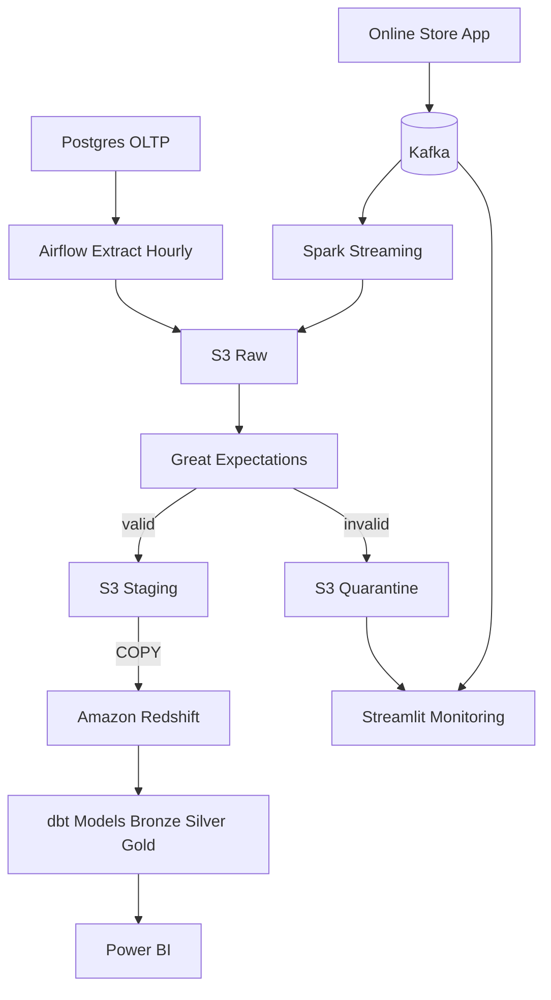

### Production Data Pipeline Architecture

This document extends the data sources in `Identifying Data Sources.md` into a realistic, production-grade data engineering pipeline aligned with the project context you described (hourly batch from Postgres, streaming logs via Kafka + Spark, validation with Great Expectations, S3 lake, Redshift DWH, dbt models, Power BI and Streamlit consumption).

## Project Context Summary
- **Goal**: Integrate OLTP batch data and streaming logs into S3 and Redshift to deliver analytics and real-time monitoring.
- **What is implemented**:
  - Airflow DAG extracts new rows from Postgres every 1 hour → S3 Raw (CSV)
  - Kafka ingests application logs; Spark Streaming writes to S3 Raw
  - Great Expectations validates schemas and quality; invalid rows → S3 Quarantine; errors visualized in Streamlit
  - S3 Staging holds validated and combined data
  - Airflow schedules Redshift COPY from S3 Staging
  - dbt builds Bronze/Silver/Gold with facts and dimensions in Redshift
  - Power BI connects to Redshift for business dashboards; Streamlit provides near real-time monitoring

## Sources
- **OLTP (On-Premises Postgres)**: Orders, Customers, Products. Extracted hourly via Airflow.
- **Online Store Logs (Event Stream)**: ~50 rows per 5 minutes; ingested via Kafka and processed by Spark Streaming.

## Ingestion
- **Batch from Postgres**: Airflow task extracts incremental new rows every 1 hour; writes CSV files to S3 Raw.
- **Streaming logs**:  online store  → Kafka topics; Spark Streaming consumes and writes to S3 Raw.
- Optional historical backfills orchestrated by Airflow.

## Validation & Data Quality
- **Schema validation**: Ensure column presence and data types match expectations.
- **Quality checks**: nulls, duplicates, ranges, referential integrity (e.g., `order_id` unique, `amount >= 0`).
- **Implementation**: Great Expectations suites; failures routed to S3 Quarantine; validation errors logged and visualized in Streamlit.

## Data Lake (S3)
- **Raw Zone**: Direct dumps from Postgres (CSV) and Spark Streaming logs.
- **Staging Zone**: Validated and conformed data (partitioned by source and date); merges batch + streaming.
- Partitioning strategy designed by source and date for efficient loads.

## Data Warehouse (Amazon Redshift)
- Automated **COPY** commands from S3 Staging → Redshift tables.
- Loads scheduled with Airflow.

## Transformations & Modeling (dbt)
- **Medallion architecture** in Redshift:
  - Bronze: raw ingested tables
  - Silver: cleaned and standardized tables
  - Gold: business-ready facts and dimensions
- **Models implemented**: `fact_orders`, `dim_customers`, `dim_products`; snapshots for SCD where needed.

## Governance & Security
- Access controls in Redshift and S3; basic PII handling; schema versions tracked in VCS.

## Monitoring & Reliability
- Streamlit dashboard for errors and service health; freshness SLAs; Airflow retries and alerts; DLQs for malformed events.

## Serving & Access
- **BI**: Power BI on Redshift Gold layer for sales, retention, error tracking.
- **Real-time monitoring**: Streamlit consuming Kafka/S3 error logs for near real-time visibility.

## Reference Architecture (Mermaid)

## Source-to-Serving Mapping
- **Postgres → Airflow → S3 Raw → GE → S3 Staging → Redshift → dbt → Power BI**: batch analytics with curated facts/dims.
- **App Logs → Kafka → Spark Streaming → S3 Raw → GE → S3 Staging → Redshift → dbt → Power BI**: behavioral analytics joined with OLTP.
- **Operational Monitoring**: Kafka and Quarantine feed Streamlit for near real-time error visibility.
